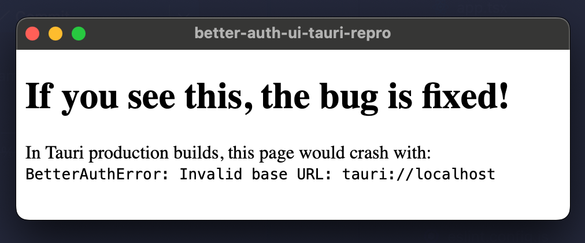

# Better Auth UI + Tauri Bug Reproduction

This is a minimal reproduction of a bug where `@daveyplate/better-auth-ui` crashes in Tauri applications.

## The Bug

When importing `@daveyplate/better-auth-ui` in a Tauri app, the app crashes at module load time with:

```
BetterAuthError: Invalid base URL: tauri://localhost. URL must include 'http://' or 'https://'
```

## Root Cause

1. `@daveyplate/better-auth-ui` creates an internal `authClient` at **module load time** in `src/types/auth-client.ts` without a `baseURL`
2. `better-auth`'s `getBaseURL()` function falls back to `window.location.origin` when no `baseURL` is provided
3. In Tauri **production builds**, `window.location.origin` is `tauri://localhost`
4. `better-auth` throws because `tauri://` is not `http://` or `https://`

This happens at **module load time**, before any React component renders, so it crashes even if you:
- Pass your own `authClient` with a proper `baseURL` to `AuthUIProvider`
- Never use the internal `authClient`

## Additional Bug

There's also a bug in `src/components/settings/teams/user-team-cell.tsx` that imports and uses the internal type-inference `authClient` directly instead of getting it from context:

```typescript
// Bug: imports module-level authClient instead of using context
import { authClient } from "../../../types/auth-client"

// Later uses it for an actual API call
await authClient.organization.setActiveTeam({ ... })
```

This component should get `authClient` from `AuthUIContext` like other components do.

## Steps to Reproduce

1. Clone this repo
2. Install dependencies: `pnpm install`
3. Build Tauri app for production: `pnpm tauri build --debug`
4. Open the built app (in `src-tauri/target/debug/bundle/`)
5. **Observe the crash**

Note: The bug does NOT appear in development mode because the Vite dev server serves from `http://localhost:1420`, which is a valid HTTP URL.

## Proposed Fix

### Fix 1: Add placeholder baseURL (prevents crash)

In `src/types/auth-client.ts`:

```typescript
export const authClient = createAuthClient({
  // Provide a placeholder baseURL to prevent errors in non-HTTP environments
  // (e.g., Tauri, Electron where window.location.origin is not HTTP)
  // This client is only used for type inference and should not be used at runtime
  baseURL: "http://localhost",
  plugins: [
    // ...
  ]
})
```

### Fix 2: Use context authClient in UserTeamCell (fixes the actual bug)

In `src/components/settings/teams/user-team-cell.tsx`:

```diff
- import { authClient } from "../../../types/auth-client"

export function UserTeamCell({ ... }) {
  const {
+   authClient,
    hooks: { useSession },
    // ...
  } = useContext(AuthUIContext)

  // Now uses authClient from context instead of the type-inference client
}
```

## Environment

- `@daveyplate/better-auth-ui`: 3.3.11
- `better-auth`: 1.4.10
- Tauri: 2.x
- Platform: macOS (also affects Windows/Linux)

## Workaround
To demonstrate the fix, patch the `@daveyplate/better-auth-ui` package to use a placeholder baseURL.

1. Add patch to `package.json`:

```json
{
  "pnpm": {
    "patchedDependencies": {
      "@daveyplate/better-auth-ui": "patches/@daveyplate__better-auth-ui.patch"
    }
  }
}
```

2. Run `pnpm install`
3. Build Tauri app for production: `pnpm tauri build --debug`
4. Open the built app (in `src-tauri/target/debug/bundle/`)

The app should not crash anymore:

